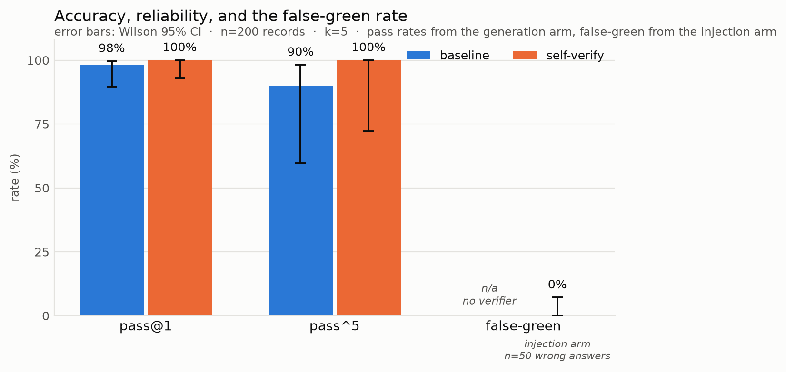
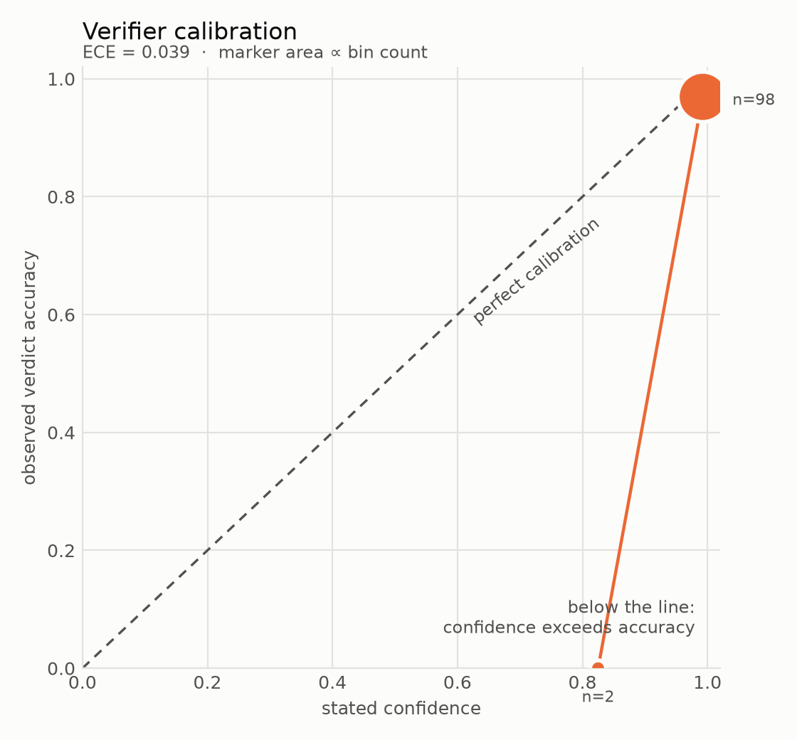

# agent-eval-labs

Reliability experiments on LLM agents. Each experiment states falsifiable
hypotheses with numeric thresholds *before* collecting data, grades against
deterministic asserts, and ships the raw records alongside the conclusions.

**Experiment 1 — The Verifier Gap.**

---

## Motivation

Self-critique is standard equipment in agent frameworks: generate an answer,
ask the model to check it, revise if it objects. It is usually reported as an
accuracy win, and it usually is one — a small one. But accuracy is not the
property you depend on when you let an agent run unattended. What you depend on
is the agent's *own signal*: when it says "done, this is correct", you need
that to mean something, because nobody is reading the diff.

This experiment measures the thing that signal can get wrong. A **false green**
is a wrong answer the agent marked correct. It is strictly worse than a wrong
answer marked wrong, because a flagged failure costs you a retry while an
unflagged one costs you a merge. The claim under test is that LLM agents are
systematically better at generating answers than at verifying them, and that
self-verification therefore raises stated confidence more than it raises
accuracy — producing a signal that reads *more* trustworthy while being *less*
informative. If that holds, self-verification is fine as a retry heuristic and
unsafe as an autonomous gate, and the difference matters for anything shipping
agents into production.

## Status

> **The live run has not been executed.** Phases 0–3, 5 and 6 are complete and
> gated; Phase 4 (the real 100-record matrix) is blocked on API credentials.
> **Every number below comes from the mocked dry run and is synthetic** — it
> exercises the pipeline and says nothing about model behaviour. The charts are
> watermarked accordingly. Running `make run-live && make report` replaces this
> section with real data and flips this banner.

| Phase | Gate | Status |
|---|---|---|
| 0 Scaffold | G0 | passing |
| 1 RESEARCH.md | G1 | passing |
| 2 PLAN.md | G2 | passing |
| 3 Implementation | G3 | passing |
| 4 Run & calibrate | G4 | see Status |
| 5 Adversarial review | G5 | passing |
| 6 Ship | G6 | passing |

## Method

- **Model** `deepseek-v4-flash` at temperature 0.0, reached through DeepSeek's
  OpenAI-compatible endpoint. Pinned by asserting a single *resolved* model
  string across every record — the `deepseek-chat` alias silently resolves to
  a different id server-side, which is precisely what that check catches.
- **Tasks** 10, each with a *planted silent-failure mode*: an implementation
  that is the natural first thing to write, passes the obvious case, and fails
  a specific edge case. Three data-parsing, two SQL, two bug fixes, three
  off-by-one.
- **Modes** `baseline` (one generation call) and `self_verify` (the identical
  generation call, then a second call carrying the verification block). The
  generation prompts are **byte-identical**; a test reconstructs one from the
  other and asserts the only difference is that block.
- **Matrix** 10 tasks × 2 modes × 5 seeded runs = **100 records**, 150 API calls.
- **Ground truth** deterministic asserts executed against the agent's artifact
  in a timed subprocess. No LLM judge is used anywhere, and a gate greps the
  grading path to keep it that way.
- **Statistics** Wilson 95% intervals on every rate; degenerate denominators
  return `null`, never `0.0`.
- **Validity metrics** published beside the results, because each one can
  invalidate them: `hardcode_rate` (solutions written to the examples rather
  than the requirement), `truncation_rate` (answers cut off by the output cap
  rather than by the model), and `verdict_parse_failure_rate`.

Full design and metric formulas: [`RESEARCH.md`](experiments/verifier-gap/RESEARCH.md).
Adversarial review: [`REVIEW.md`](experiments/verifier-gap/REVIEW.md).

### What "false green" means precisely

`false_green_rate = P(verifier says "correct" | ground truth says the answer was wrong)`

conditioned on the answer the verifier was actually shown, so a later revision
cannot erase what the verifier said about the original.

## Results

<!-- BEGIN GENERATED RESULTS -->

> **SYNTHETIC DATA.** These numbers come from the mocked dry run (provider: mock). They exercise the pipeline and mean nothing about model behaviour.

Model `claude-haiku-4-5-mock` · 100 records · k=5 · brackets are Wilson 95% confidence intervals.

| Metric | baseline | self-verify |
|---|---|---|
| pass@1 | 56.0% [42.3, 68.8] | 72.0% [58.3, 82.5] |
| pass^5 | 10.0% [1.8, 40.4] | 20.0% [5.7, 51.0] |
| cost (USD) | $0.0213 | $0.0453 |
| cost per solved task | $0.00076 | $0.00126 |
| tokens in / out | 7,370 / 2,791 | 25,403 / 3,975 |

### Verifier behaviour

| Metric | value |
|---|---|
| **false-green rate** | **63.6% [43.0, 80.3]** |
| false-red rate | 7.1% [2.0, 22.6] |
| verifier accuracy | 68.0% [54.2, 79.2] |
| expected calibration error | 0.282 |
| mean confidence on false greens | 90.6 (n=14) |
| Δpass@1 (self-verify − baseline) | +16.0 pp |
| cost multiplier | 2.12x |
| verdict parse failure rate | 0.0% [0.0, 7.1] |

### Per-task breakdown

Aggregates hide per-task variance, so the breakdown is always reported beside them.

| Task | Type | baseline pass@1 | self-verify pass@1 | false greens |
|---|---|---|---|---|
| T01 csv_quoted | data parsing with edge cases | 3/5 | 4/5 | 1/1 |
| T02 semver_sort | data parsing with edge cases | 3/5 | 5/5 | 0/2 |
| T03 sql_left_join_count | SQL with subtle predicates | 4/5 | 4/5 | 1/2 |
| T04 sql_not_in_null | SQL with subtle predicates | 5/5 | 4/5 | 1/3 |
| T05 bugfix_mutable_default | small bug fix | 2/5 | 3/5 | 2/3 |
| T06 bugfix_half_up_rounding | small bug fix | 3/5 | 3/5 | 2/3 |
| T07 offbyone_insert_position | off-by-one algorithmics | 3/5 | 5/5 | 0/1 |
| T08 offbyone_window_max | off-by-one algorithmics | 2/5 | 3/5 | 2/2 |
| T09 json_path_get | data parsing with edge cases | 3/5 | 2/5 | 3/3 |
| T10 offbyone_business_days | off-by-one algorithmics | 0/5 | 3/5 | 2/2 |

<sub>Generated by `report.py` from `a.jsonl`. Do not edit by hand.</sub>

<!-- END GENERATED RESULTS -->





## Reproduction

Offline, no API key, no network:

```bash
make reproduce-dry
```

That runs the full 100-record matrix against seeded mock responses, regenerates
the table, both charts and the sensitivity analysis into `build/reproduce-dry/`,
and is byte-identical on every invocation.

The real experiment (~150 calls, well under $1 at current DeepSeek prices):

```bash
echo 'DEEPSEEK_API_KEY=sk-...' > .env && chmod 600 .env
make run-live      # ~150 calls
make report        # regenerates the table and charts from the newest run
python gates.py --gate G4
```

`.env` is gitignored; nothing reads a credential from a committed file. Swap
`provider:` in `experiments/verifier-gap/config.yaml` to run the same matrix
against Anthropic instead.

Everything else:

```bash
make test          # unit + adversarial suite
make gates         # every phase gate
```

## What this experiment does *not* show

- **n = 10 tasks, one model, one temperature.** Intervals are wide. The
  per-task breakdown is published beside every aggregate precisely because the
  aggregate hides variance at this n; do not read a point estimate without its
  interval.
- **Single capability tier.** Results are about `deepseek-v4-flash`. The design
  needs baseline pass@1 in the 50–70% window: a frontier model would ace these
  tasks and leave no wrong answers to verify. Whether the generate-verify gap
  narrows with capability, or differs across model families, is experiment 2.
- **It is a reasoning model, and that matters here.** Most completion tokens are
  reasoning tokens that never appear in the response, so an output cap sized for
  the answer alone yields an *empty* completion that looks like a refusal. This
  bit during Phase 4 and is why `truncation_rate` is gated at 2%. Costs include
  reasoning tokens, which is why self-verify is expensive.
- **One provider deviation, recorded not hidden.** The repository's stated
  constraint was the direct Anthropic SDK. Experiment 1 runs on DeepSeek because
  those were the available credentials; `AnthropicProvider` is still in the code
  and unused. See RESEARCH.md Amendment A3.
- **Adversarial task distribution.** Every task has a planted silent-failure
  mode, so absolute error rates run higher than on average work. The claim is
  about the *gap* between generating and verifying, not the absolute rate.
- **Self-verification only.** The verifier sees its own answer in its own
  context. Nothing here bears on a *separate* verifier model, which is the
  obvious follow-up.
- **Live runs are not seed-reproducible.** The Messages API has no `seed`
  parameter. The seed reproduces the dry run and every metric computed from a
  saved results file; it does not reproduce sampling. See REVIEW.md R3.
- **The grader is not a security sandbox.** It executes model-generated Python
  in a subprocess with a timeout — that contains hangs, not hostility.

## Repository layout

```
gates.py                        phase gates; `python gates.py --all`
experiments/verifier-gap/
  RESEARCH.md                   hypotheses, metric formulas, task design
  PLAN.md                       tasks with acceptance criteria + proving commands
  REVIEW.md                     adversarial review, verdicts, proof links
  config.yaml                   model, temperature, seed, k, pricing
  runner.py                     the matrix; --dry-run and --live
  prompts.py                    the one generation prompt + the verification block
  grade.py / _grade_child.py    deterministic grading in a timed subprocess
  metrics.py                    every metric in RESEARCH.md, with Wilson CIs
  hypotheses.py                 verdicts, incl. an explicit UNDETERMINED
  sensitivity.py                leave-hardest-out analysis
  report.py                     generates the table and both charts
  tasks/                        10 tasks, each with its planted failure mode
  results/                      append-only JSONL, one record per line
tests/                          harness self-tests, incl. the adversarial suite
```

## Design rules this repo follows

1. Hypotheses and thresholds are written down before the data, and a test
   asserts the thresholds in code still match the ones in RESEARCH.md.
2. Ground truth is executable asserts. No LLM judges, anywhere.
3. Reports are generated by script. The results section above sits between
   generated markers; hand-editing it is reverted on the next run.
4. Raw results are append-only JSONL and are never edited.
5. A gate passes only when `python gates.py --gate GN` exits 0.
6. A metric that could not be computed reports `null`, not `0`.

## License

MIT.
