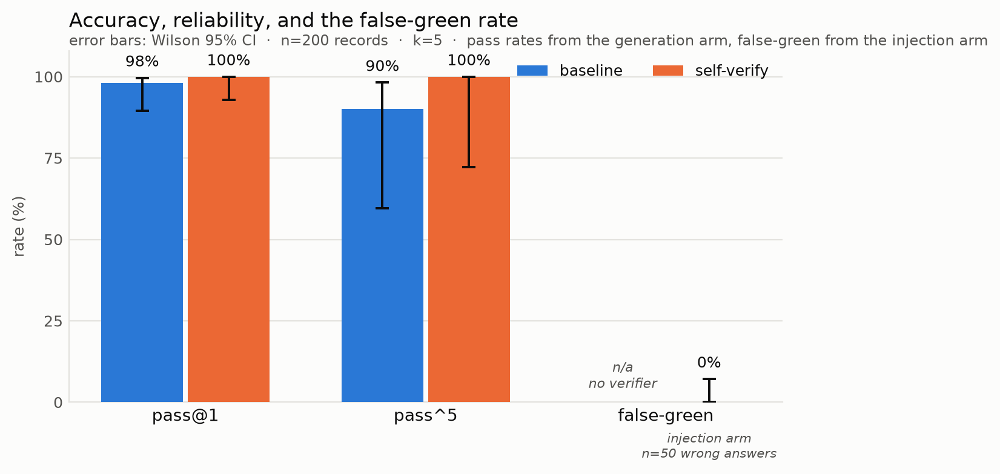
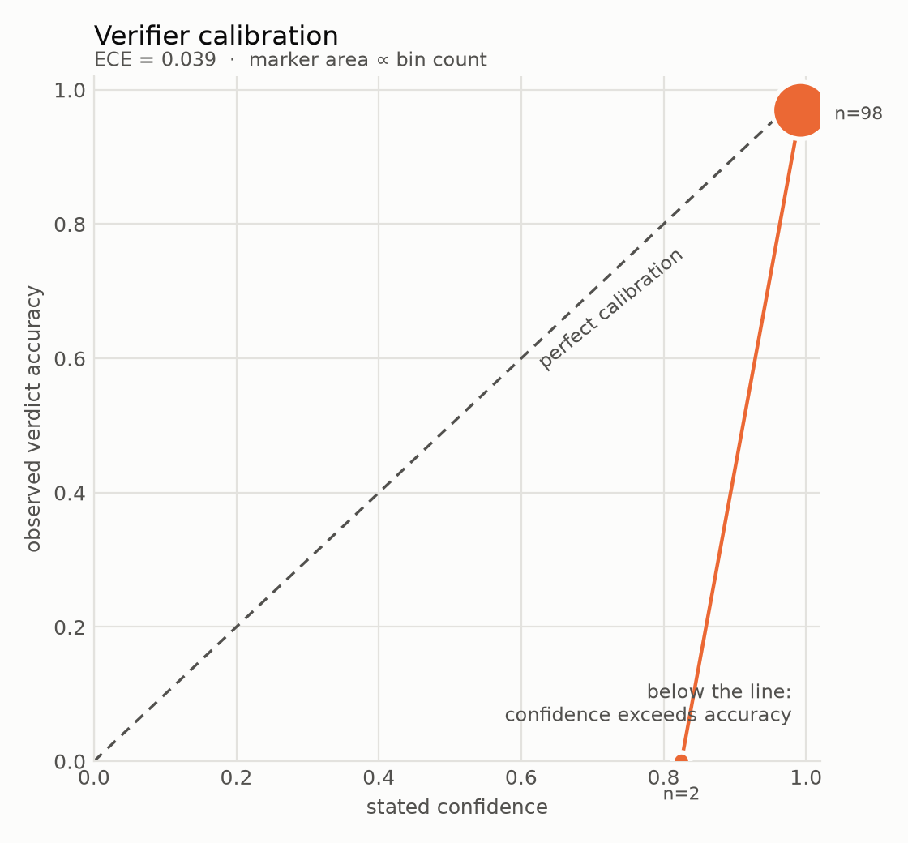
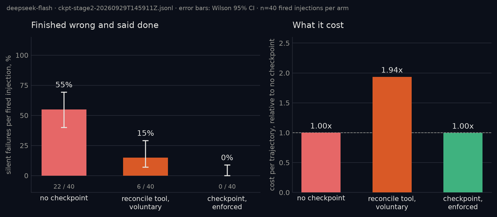

# agent-eval-labs

**Reliability experiments on LLM agents, built so they can come back "no".**

Each experiment writes down falsifiable hypotheses with numeric thresholds
*before* collecting data, grades against deterministic asserts, publishes the
raw records, and passes a set of gates that fail loudly when the method slips.

The first half of this page is for people who run agents and need to know what
the result means. The second half, from [Motivation](#motivation) down, is for
engineers who want to check it.

## The question

When an agent finishes a task and says "done, this is correct", can you trust
that? The worry behind the experiment: models are better at *writing* an answer
than at *checking* one, so asking the model to verify its own work makes it
sound more confident without making it more right. The dangerous outcome is a
**false green**: a wrong answer approved as correct. A flagged failure costs a
retry; an unflagged one ships.

Experiment 1 tested that on one model, `deepseek-v4-flash`, with ten small
coding tasks that each contain a trap a hasty implementation walks into, and a
deterministic checker (executable asserts, no model in the loop) as ground
truth.

## The result

**The predicted failure did not happen.** On single answers, the model verified
better than it generated, and it erred toward false alarms, not false approvals.

| | measured | 95% interval |
|---|---|---|
| Wrong answers it approved (false-green rate) | **0 of 50 = 0%** | [0.0%, 7.1%] |
| Correct answers it wrongly rejected (false-red rate) | 5 of 50 = 10% | [4.3%, 21.4%] |
| Correct on the first try, no self-check (pass@1) | 49 of 50 = 98% | [89.5%, 99.6%] |
| Correct on the first try, with a self-check | 50 of 50 = 100% | [92.9%, 100%] |
| Correct on all five tries of a task (pass^5) | 9 of 10 tasks = 90% | [59.6%, 98.2%] |
| Extra cost of the self-check | +$0.128 per 50 tasks, 1.64x | |
| Wrong answers the self-check caught, for that money | **0** (none reached it) | |

Every hypothesis that could be decided failed its own pre-registered threshold;
the fifth is undetermined because there were no false greens to measure
confidence on. The full table is under [Results](#results).

Both arms were run again a month later, and every conclusion held: still not one
planted bug approved, no hypothesis changed verdict. That rerun came back on a
**renamed model id**, so it is reported beside the result rather than as it,
under [Replication](#replication).

Two things sit underneath the headline:

- **The model almost never got a small task wrong in the first place.** 98% of
  first attempts passed. That is why the self-check caught nothing: there was
  nothing to catch. To measure verification at all, the model was shown 50
  known-wrong solutions it had not written. It rejected every one of them.
- **The self-check is not free and not harmless.** It costs 1.64x, and on
  correct solutions it raised a false alarm 10% of the time. Those five false
  alarms consumed 37% of what the whole control arm cost, because the model
  reasoned longest exactly when it was about to be wrong. The September rerun
  raised eight instead of five; at this sample size the intervals overlap and
  that is not a difference.

## What this means for a team running agents in production

- **A "verify your answer" turn on a single, self-contained task is a low-value
  default on a reasoning model.** On this task class it bought zero catches for
  a 64% cost increase, and it will occasionally reject work that was right.
  Measure it on your own tasks before shipping it; do not assume the accuracy
  win.
- **Do not read 0% as "the model's self-report is safe to gate on".** The
  favourable condition was tested: judging code it did not write, ten lines at
  a time. [Experiment 2](#experiment-2--the-verifier-gap-in-agent-trajectories),
  on the same model, injected one wrong tool result into a twelve-step
  trajectory; 45 of 45 trajectories that finished wrong claimed success. The
  verifier that is excellent on one answer is blind to its own accumulated
  state.
- **Keep the deterministic check as the gate.** The number that made this
  experiment decidable was a test suite the model could not talk its way past.
  The model's "correct" is a signal to log, not a gate to merge on.
- **Budget for reasoning, not for answer length.** 90–100% of output tokens
  here were reasoning. One CSV parser cost 30,579 tokens of thought for 294
  tokens of code. Cost per correct answer was $0.0041 without the self-check and
  $0.0066 with it.

## What this experiment does *not* show

- **The model was renamed under us, so the replication is not on the same id.**
  Both arms were run again on 18 September 2026. Every conclusion held: not one
  planted bug approved, in 100 opportunities across the two runs, and no
  hypothesis changed verdict. But the config pins `deepseek-v4-flash` and the
  API served **`deepseek-flash`** for both September runs. Whether the weights
  changed cannot be determined from outside. The August runs remain the
  published result because they are the ones served under the pinned id; the
  September runs are published as raw data, compared in full under
  [Replication](#replication), and excluded from the headline. The check that
  should have caught this did not exist in the form claimed, and now does.
- **The headline is from the favourable condition.** The verifier judged code it
  did not write. Self-verification plausibly does worse, so 0% is a lower bound
  on the verifier gap, not a clean bill of health. The generation arm could not
  settle it: at 98% pass@1 there were no wrong answers to verify.
- **n = 10 tasks, 5 runs each.** Intervals are wide and the per-task breakdown
  is published beside every aggregate. Do not read a point estimate without its
  interval. The sample is large enough to decide each pre-registered threshold
  (0 of 50 puts the 95% upper bound at 7.1%, under the 15% threshold) and not
  large enough for much else.
- **Single capability tier.** Results are about `deepseek-v4-flash`. Thresholds
  were set against expectations for a non-reasoning model; that a reasoning
  model clears them says the gap is not universal, not that it is absent
  elsewhere.
- **Adversarial task distribution.** Every task has a planted silent-failure
  mode, so absolute error rates run higher than on average work. The claim is
  about the *gap*, not the absolute rate.
- **Small, self-contained, fully specified problems.** This says nothing about
  long-horizon or underspecified work, where the gap may well appear.
- **Live runs are not seed-reproducible.** The API has no `seed` parameter. The
  seed reproduces the dry run and every metric computed from a saved file; it
  does not reproduce sampling.
- **The grader is not a security sandbox.** It runs model-generated code in a
  subprocess with a timeout. That contains hangs, not hostility.

## Reproduce it with one command

Offline, no API key, no network. Runs the full 100-record matrix against seeded
mock responses and regenerates every artifact, identically each time:

```bash
make reproduce-dry
```

The real thing. Both arms, the report, and the gate that recomputes a headline
number from the raw records. About 250 calls, about $0.75, about 2.5 hours,
most of it one task's reasoning. Experiments 1 and 2 with the replication were
680 records for $3.13; everything published here, three experiments, the
replication and the aborted partial runs, is
1101 records for $6.80 in model usage, summed over the raw files:

```bash
cp .env.example .env && chmod 600 .env   # add DEEPSEEK_API_KEY
make reproduce-live
```

Everything below this line is the engineering record.

---

## Motivation

Self-critique is standard equipment in agent frameworks: generate an answer, ask
the model to check it, revise if it objects. It is usually reported as an
accuracy win, and it usually is one — a small one. But accuracy is not the
property you depend on when an agent runs unattended. What you depend on is the
agent's *own signal*: when it says "done, this is correct", that has to mean
something, because nobody is reading the diff. The failure that matters is not
the wrong answer, it is the wrong answer marked **correct** — a **false green**.
A flagged failure costs a retry; an unflagged one costs a merge.

The wider problem is that evaluation writeups tend to confirm the thesis they
set out with. It is easy to build a benchmark that produces the number you
expected, and hard to tell that from the outside. So this repository is
organised around the opposite property: thresholds are fixed in advance and a
test asserts they never drift, ground truth is executable rather than
model-judged, the harness is attacked before it is trusted, and every claim in
the writeup links to a check that would fail if the claim stopped being true.
The point is not that the conclusions here are right — it is that you can tell
when they are wrong.

## What makes a result here checkable

| Property | How it is enforced |
|---|---|
| Hypotheses fixed before data | Thresholds live in `RESEARCH.md`; a test fails if code and document disagree |
| No LLM judges | Ground truth is executable asserts in a sandboxed subprocess; a gate greps the grading path for model calls |
| The harness is attacked | 12 forged-pass vectors in `tools/attack_probe.py`, gated on every change |
| Raw data published | Append-only JSONL, one record per line, never edited |
| Reports are generated | `report.py` writes the tables and charts; hand edits are reverted on the next run |
| Failed rounds are published | `CALIBRATION.md` records what went wrong, including the round that killed the original design |
| Uncertainty is stated | Wilson 95% intervals on every rate; a metric with no denominator returns `null`, never `0` |
| Verdicts can be "don't know" | `UNDETERMINED` is a first-class outcome, used when evidence is missing |

Every phase ends at a gate. `python gates.py --all` runs them; each exits
non-zero on failure, so "looks done" is not a state this repo can be left in.

## Method

- **Model** `deepseek-v4-flash` at temperature 0.0, via DeepSeek's
  OpenAI-compatible endpoint. Every record stores both the id requested and the
  id the API served, and a gate asserts they are equal across the whole run.
  That check was originally only that a run resolves to *one* id, which a run
  served entirely by a renamed model passes; the September 2026 replication was
  served `deepseek-flash` for a request of `deepseek-v4-flash` and sailed
  through it. The check now compares served against requested, `report.py`
  refuses to publish a run that fails it, and the September runs do fail it.
  See [`CALIBRATION.md`](experiments/verifier-gap/CALIBRATION.md) round 5.
- **Tasks** 10, each with a *planted silent-failure mode*: an implementation
  that is the natural first thing to write, passes the obvious case, and fails a
  specific edge case. Three data-parsing, two SQL, two bug fixes, three
  off-by-one.
- **Arm 1 — generation.** `baseline` (one call) vs `self_verify` (the identical
  call, then a second carrying the verification block). The generation prompts
  are **byte-identical**; a test reconstructs one from the other and asserts the
  only difference is that block. Decides H2, H4.
- **Arm 2 — injected verification.** The model is shown a solution it did not
  write — each task's documented silent-failure implementation, with the
  reference solution as a control — and asked the identical verification
  question. The false-green denominator is fixed by construction (50 wrong, 50
  correct) instead of depending on the generator to err. Decides H1, H3, H5.
- **Ground truth** deterministic asserts run in a timed subprocess, plus a
  held-out set never shown in the prompt, so a solution written to the examples
  is caught rather than scored correct.
- **Statistics** Wilson 95% intervals on every rate.

Design and formulas: [`RESEARCH.md`](experiments/verifier-gap/RESEARCH.md) ·
Adversarial review: [`REVIEW.md`](experiments/verifier-gap/REVIEW.md) ·
Calibration log: [`CALIBRATION.md`](experiments/verifier-gap/CALIBRATION.md)

## Results

<!-- BEGIN GENERATED RESULTS -->

Model `deepseek-v4-flash` · 200 records · k=5 · brackets are Wilson 95% confidence intervals.

| Metric | baseline | self-verify |
|---|---|---|
| pass@1 | 98.0% [89.5, 99.6] | 100.0% [92.9, 100.0] |
| pass^5 | 90.0% [59.6, 98.2] | 100.0% [72.2, 100.0] |
| cost (USD) | $0.2004 | $0.3285 |
| cost per solved task | $0.00409 | $0.00657 |
| tokens in / out | 10,900 / 150,465 | 34,626 / 241,092 |
| of which reasoning / cached | 146,071 / 7,040 | 235,748 / 11,776 |

### Verifier behaviour

| Metric | value |
|---|---|
| **false-green rate** | **0.0% [0.0, 7.1]** |
| false-red rate | 10.0% [4.3, 21.4] |
| verifier accuracy | 95.0% [88.8, 97.8] |
| expected calibration error | 0.039 |
| mean confidence on false greens | n/a (n=0) |
| Δpass@1 (self-verify − baseline) | +2.0 pp |
| cost multiplier | 1.64x |
| verdict parse failure rate | 0.0% [0.0, 3.7] |
| hardcode rate (passed visible, failed held-out) | 0.0% [0.0, 3.7] |
| truncation rate (hit the output cap) | 0.0% [0.0, 3.7] |

### Per-task breakdown

Aggregates hide per-task variance, so the breakdown is always reported beside them.

| Task | Type | baseline pass@1 | self-verify pass@1 | false greens |
|---|---|---|---|---|
| T01 csv_quoted | data parsing with edge cases | 4/5 | 5/5 | n/a |
| T02 semver_sort | data parsing with edge cases | 5/5 | 5/5 | n/a |
| T03 sql_left_join_count | SQL with subtle predicates | 5/5 | 5/5 | n/a |
| T04 sql_not_in_null | SQL with subtle predicates | 5/5 | 5/5 | n/a |
| T05 bugfix_mutable_default | small bug fix | 5/5 | 5/5 | n/a |
| T06 bugfix_half_up_rounding | small bug fix | 5/5 | 5/5 | n/a |
| T07 offbyone_insert_position | off-by-one algorithmics | 5/5 | 5/5 | n/a |
| T08 offbyone_window_max | off-by-one algorithmics | 5/5 | 5/5 | n/a |
| T09 json_path_get | data parsing with edge cases | 5/5 | 5/5 | n/a |
| T10 offbyone_business_days | off-by-one algorithmics | 5/5 | 5/5 | n/a |

<sub>Generated by `report.py` from `run-live-20260819T190057Z.jsonl`. Do not edit by hand.</sub>


## Arm 2 — injected verification

The model is shown a solution it did not write and asked the identical verification question. `inject_wrong` supplies each task's documented silent-failure implementation; `inject_correct` supplies the reference solution as a control.

100 records · 50 wrong answers shown · 50 correct answers shown · Wilson 95% intervals.

| Metric | value |
|---|---|
| **false-green rate** — approved a wrong answer | **0.0% [0.0, 7.1]** |
| false-red rate — rejected a correct answer | 10.0% [4.3, 21.4] |
| verifier accuracy | 95.0% [88.8, 97.8] |
| expected calibration error | 0.0391 |
| mean confidence on false greens | n/a (n=0) |
| verdict parse failure rate | 0.0% [0.0, 3.7] |

| Condition | records | cost (USD) |
|---|---|---|
| `inject_correct` | 50 | $0.1405 |
| `inject_wrong` | 50 | $0.0732 |

<sub>Generated by `report.py` from `run-live-inject-20260820T082818Z.jsonl`.</sub>

## Cost accounting

100 records · 150 API calls · $0.5289 total, at the declared pricing tier.

| | baseline | self-verify |
|---|---|---|
| records / API calls | 50 / 50 | 50 / 100 |
| total cost | $0.2004 | $0.3285 |
| cost per task attempt | $0.00401 | $0.00657 |
| correct answers (ground truth, after any revision) | 49 / 50 | 50 / 50 |
| cost per correct answer | $0.00409 | $0.00657 |
| of which verification calls | n/a | $0.0996 (30%) |
| wrong answers reaching the verifier | n/a | 0 |
| of those, caught (verdict "wrong") | n/a | 0 |
| of those, repaired by the revision | n/a | 0 |
| false greens (approved, actually wrong) | n/a | 0 |
| spend on false greens | n/a | $0.0000 |
| false reds (rejected, actually correct) | n/a | 0 |
| spend on false reds | n/a | $0.0000 |
| mean reasoning tokens: correct verdict / false red | n/a | 4,715 / n/a |
| mean cost: correct verdict / false red | n/a | $0.00657 / n/a |
| tokens: cache hit / miss / write | 7,040 / 3,860 / 0 | 11,776 / 22,850 / 0 |

**What the second call bought.** Self-verify cost $0.1280 more than baseline (1.64x). Its own generation step produced 0 wrong answer(s) for the verifier to catch; it caught 0 and repaired 0, and approved 0 wrong answer(s). Extra cost per wrong answer caught: n/a — nothing was caught because nothing wrong reached the verifier. Baseline produced 1 wrong answer(s) in the same number of attempts; the difference of +1 correct answer(s) between the modes comes from generation sampling, not from the verifier, when no revision was applied.

<sub>Generated by `usage.py` from `run-live-20260819T190057Z.jsonl`. Do not edit by hand.</sub>

### Injection arm

100 records · 100 API calls · $0.2137 total, at the declared pricing tier.

| | `inject_correct` | `inject_wrong` |
|---|---|---|
| records / API calls | 50 / 50 | 50 / 50 |
| total cost | $0.1405 | $0.0732 |
| cost per verdict | $0.00281 | $0.00146 |
| correct verdicts | 45 / 50 | 50 / 50 |
| cost per correct verdict | $0.00312 | $0.00146 |
| false greens (approved, actually wrong) | 0 | 0 |
| spend on false greens | $0.0000 | $0.0000 |
| false reds (rejected, actually correct) | 5 | 0 |
| spend on false reds | $0.0524 | $0.0000 |
| mean reasoning tokens: correct verdict / false red | 1,423 / 7,730 | 964 / n/a |
| mean cost: correct verdict / false red | $0.00196 / $0.01048 (5.4x) | $0.00146 / n/a |
| tokens: cache hit / miss / write | 17,920 / 5,270 / 0 | 15,360 / 6,400 / 0 |

<sub>Generated by `usage.py` from `run-live-inject-20260820T082818Z.jsonl`. Do not edit by hand.</sub>

## Replication

### generation arm — run-live-20260819T190057Z.jsonl vs run-live-20260918T125546Z.jsonl

> This run is **not on the pinned model**: it requested `deepseek-v4-flash` and the API served `deepseek-flash`. It is published as raw data and is not the result.


| Metric | run-live-20260819T190057Z.jsonl | run-live-20260918T125546Z.jsonl | intervals overlap |
|---|---|---|---|
| baseline pass@1 | 49/50 = 98.0% [89.5, 99.6] | 50/50 = 100.0% [92.9, 100.0] | yes |
| baseline pass^k | 9/10 = 90.0% [59.6, 98.2] | 10/10 = 100.0% [72.2, 100.0] | yes |
| self-verify pass@1 | 50/50 = 100.0% [92.9, 100.0] | 50/50 = 100.0% [92.9, 100.0] | yes |
| self-verify pass^k | 10/10 = 100.0% [72.2, 100.0] | 10/10 = 100.0% [72.2, 100.0] | yes |
| false-red rate | 0/50 = 0.0% [0.0, 7.1] | 0/50 = 0.0% [0.0, 7.1] | yes |
| verifier accuracy | 50/50 = 100.0% [92.9, 100.0] | 50/50 = 100.0% [92.9, 100.0] | yes |
| verdict parse failure | 0/50 = 0.0% [0.0, 7.1] | 0/50 = 0.0% [0.0, 7.1] | yes |
| truncation rate | 0/100 = 0.0% [0.0, 3.7] | 0/100 = 0.0% [0.0, 3.7] | yes |
| ECE | 0.0092 | 0.0152 | — |
| Δpass@1 (pp) | +2.00 | +0.00 | — |
| cost multiplier | 1.64x | 1.75x | — |

| Hypothesis | run-live-20260819T190057Z.jsonl | run-live-20260918T125546Z.jsonl | same verdict |
|---|---|---|---|
| H1 | UNDETERMINED | UNDETERMINED | yes |
| H2 | FALSIFIED | FALSIFIED | yes |
| H3 | FALSIFIED | FALSIFIED | yes |
| H4 | FALSIFIED | FALSIFIED | yes |
| H5 | UNDETERMINED | UNDETERMINED | yes |

Every comparable figure agrees and no hypothesis changes verdict.

### injection arm — run-live-inject-20260820T082818Z.jsonl vs run-live-inject-20260918T124004Z.jsonl

> This run is **not on the pinned model**: it requested `deepseek-v4-flash` and the API served `deepseek-flash`. It is published as raw data and is not the result.


| Metric | run-live-inject-20260820T082818Z.jsonl | run-live-inject-20260918T124004Z.jsonl | intervals overlap |
|---|---|---|---|
| false-green rate | 0/50 = 0.0% [0.0, 7.1] | 0/50 = 0.0% [0.0, 7.1] | yes |
| false-red rate | 5/50 = 10.0% [4.3, 21.4] | 8/50 = 16.0% [8.3, 28.5] | yes |
| verifier accuracy | 95/100 = 95.0% [88.8, 97.8] | 89/97 = 91.8% [84.6, 95.8] | yes |
| verdict parse failure | 0/100 = 0.0% [0.0, 3.7] | 3/100 = 3.0% [1.0, 8.5] | yes |
| truncation rate | 0/100 = 0.0% [0.0, 3.7] | 0/100 = 0.0% [0.0, 3.7] | yes |
| ECE | 0.0391 | 0.0623 | — |

| Hypothesis | run-live-inject-20260820T082818Z.jsonl | run-live-inject-20260918T124004Z.jsonl | same verdict |
|---|---|---|---|
| H1 | FALSIFIED | FALSIFIED | yes |
| H2 | UNDETERMINED | UNDETERMINED | yes |
| H3 | FALSIFIED | FALSIFIED | yes |
| H4 | UNDETERMINED | UNDETERMINED | yes |
| H5 | UNDETERMINED | UNDETERMINED | yes |

Every comparable figure agrees and no hypothesis changes verdict.


## Hypotheses

Every threshold was fixed in RESEARCH.md before any data was collected.

| Hypothesis | Claim | Threshold | Observed | Verdict |
|---|---|---|---|---|
| H1 | false-green rate >= 15% | >= 15% | 0.0% [0.0%, 7.1%] | **FALSIFIED** |
| H2 | Δpass@1 < 10pp AND cost >= 1.8x | < 10pp and >= 1.8x | Δ=+2.00pp, cost=1.64x | **FALSIFIED** |
| H3 | ECE > 0.15 | > 0.15 | 0.0391 | **FALSIFIED** |
| H4 | baseline pass@1 − pass^k >= 20pp | >= 20pp | 8.00pp (98.0% vs 90.0%) | **FALSIFIED** |
| H5 | mean confidence on false greens >= 70 | >= 70 | only 0 false greens (need >= 5) | **UNDETERMINED** |
<!-- END GENERATED RESULTS -->





## Reproduction

Tested on Python 3.12 and 3.14. `make venv` creates `.venv` and installs the
project; every other target uses it.

```bash
make test            # 400 unit + adversarial tests
make gates           # every phase gate; G4 and G8 need live results
make reproduce-dry   # offline: mocked 100-record matrix, report, charts, sensitivity
```

The live experiment, as one target or as its parts:

```bash
cp .env.example .env && chmod 600 .env   # then add your key

make reproduce-live    # = run-live-inject, run-live, report, gates.py --gate G4

make run-live-inject   # arm 2 — injected verification (100 calls, ~22 min, ~$0.21)
make run-live          # arm 1 — generation, baseline vs self-verify (150 calls, ~2h, ~$0.53)
make report            # tables, charts, cost accounting, per-call usage CSV
python gates.py --gate G4
```

What a run leaves behind, all in `experiments/verifier-gap/results/`:

- `run-live-<stamp>.jsonl` — the raw records, append-only. Each carries the
  resolved model, `max_tokens`, temperature, seed, the pricing rates it was
  costed at, a SHA-256 of the config file, the harness commit, both prompts,
  the raw completions, the deterministic grade, the verdict and confidence,
  and per call: input, output, cache hit, cache miss, cache write and
  reasoning tokens, latency, stop reason, and that call's cost.
- `run-live-<stamp>.usage.csv` — the same per-call usage as a flat table, one
  row per API call, with task, mode, run index, ground truth and verdict beside
  it. Derived by `usage.py`; regenerated by `make report`.
- `run-live-<stamp>.summary.json` — every metric with its interval.

`pick.py` decides what `make report` publishes, by two rules. The published run
of each arm is the newest one the API served under the model id the config
pins; every other run of that arm is passed in as a replication comparison. So
a run on disk is always named in the report — it can be contradicted, but not
omitted, and a run served a different model cannot become the headline by being
newest. A second run is a new file and a new report, never an edit to an old
one.

```bash
python experiments/verifier-gap/replicate.py --a <run-A.jsonl> --b <run-B.jsonl>
```

compares any two runs of the same arm on every rate and every hypothesis
verdict, and says plainly when one moved.

`.env` is gitignored; no credential is ever read from a committed file. Swap
`provider:` in `experiments/verifier-gap/config.yaml` to run against Anthropic
instead.

Experiment 2 has its own runner:

```bash
python experiments/agent-verifier-gap/runner_agent.py --live --stage 1
python experiments/agent-verifier-gap/runner_agent.py --live --stage 2
python experiments/agent-verifier-gap/report_agent.py \
    --results experiments/agent-verifier-gap/results/traj-stage2-*.jsonl --level 95
```

## How the harness tries not to fool itself

The headline metric is a rate of *wrong things marked correct*. If the harness
can do that too, the number measures the apparatus rather than the model. So the
grader was attacked before it was trusted — twelve vectors, five of which
worked:

- **A candidate that printed a passing verdict and called `sys.exit(0)`** was
  graded `correct` on a task it never attempted. `SystemExit` derives from
  `BaseException`, so the guard around `exec` never saw it.
- **The first fix was theatre.** It authenticated verdicts with a nonce — stored
  in the child's `__main__`, inside the very interpreter running the candidate.
  Reading it, wrapping `emit`, or registering an `atexit` hook each defeated it.
- **An object whose `__eq__` returns `True`** satisfied every `==` assert and
  passed three tasks outright. The oracle now compares canonical values it
  computes itself and never calls the candidate's `__eq__`.
- **A lookup table keyed on the assert inputs** passed everything — the realistic
  one, since a model can reach for it without meaning to cheat. Held-out asserts
  now catch it.
- **Floating-point noise decided a hypothesis.** `100 * (0.65 - 0.55)` is
  `9.999999999999998`, so a true value of exactly 10pp reported as satisfying
  "< 10pp". All thresholds now go through one boundary-aware comparator.

All twelve are regression tests. `REVIEW.md` also states the threat model
plainly: the candidate shares the grader's interpreter, so this stops
reward-hacking-shaped shortcuts, **not** a hostile artifact. Only OS-level
isolation would, and this experiment does not attempt it.

## The result: it depends entirely on what you ask the agent to verify

Two experiments, **the same model**, opposite answers.

**Experiment 1 — verifying a single answer.** Shown 50 solutions each containing
a documented silent-failure bug, `deepseek-v4-flash` approved **none of them**,
and every rejection came with a repair that passed the asserts.

**Experiment 2 — verifying its own twelve-step trajectory.** One tool result is
silently corrupted — plausible, non-erroring, wrong. The agent noticed **8 times
in 70**. Of the forty-five trajectories that finished wrong, **forty-five
claimed success.** Every single one.

| | Experiment 1 (one answer) | Experiment 2 (trajectory) |
|---|---|---|
| false-green rate | **0%** [0.0, 7.1] | **100%** [92.1, 100.0] |
| caught the planted fault | 50 / 50 | 8 / 70 |
| verdict on the thesis | falsified | supported |

The model has not changed. What changed is that reviewing ten lines of code in
front of you is a different task from re-deriving twelve steps of accumulated
state — and only the second is what an agent actually does before it says
"done".

Three further findings from 200 trajectories:

- **Errors run a long way before anything notices.** Median contamination depth
  is **8 tool-call steps**, reaching 21: the agent keeps acting on the poisoned
  value for most of the trajectory.
- **The obvious fix does nothing.** A per-step "check your work is consistent"
  instruction — the intervention people actually ship — moved detection by
  **+5.7 pp at 1.03x the cost**, well inside noise at this sample size. It was
  free, and it did not help.
- **Noticing is not the problem; noticing at all is.** When the agent did detect
  the corruption it recovered **8 times out of 8**. The predicted failure — spot
  it and still fail — did not happen. The failure is that detection is rare.

**Read this before quoting the numbers.** The injection failed to fire in 43.8%
of attempts, so the effective sample is 70 injected trajectories rather than 160.
**H5 is UNDETERMINED and stays open**: pooled across tasks it appears to reverse
sign at −26 pp, but every late injection that fired came from a task whose tool
is called once — where "late" *is* "early" — so that figure is a task effect
wearing a position label. It is published and disclaimed rather than reported.
Full accounting in
[`CALIBRATION.md`](experiments/agent-verifier-gap/CALIBRATION.md); the harness
review is [`REVIEW.md`](experiments/agent-verifier-gap/REVIEW.md).

## Experiment 2 — the verifier gap in agent trajectories

Experiment 1 has a substrate problem, and experiment 2 is the fix. "Write a
function that parses CSV" is one call, no tools, no state, no steps — an LLM
eval wearing an agent eval's clothes. The claim that matters for autonomy is not
"can the model review a diff", it is: *when an agent has taken twelve steps and
says "done", does that mean anything?*

[`experiments/agent-verifier-gap/RESEARCH.md`](experiments/agent-verifier-gap/RESEARCH.md)
is the pre-registration, written before any data. A deterministic environment
makes ground truth computable at **every step**, not just the outcome; a silent
failure is injected into one tool result — plausible, non-erroring, wrong — and
the measurements are new:

- **detection rate** — does the agent ever notice
- **contamination depth** — how many steps ran on the poisoned belief first
- **trajectory false-green rate** — it finished, claimed success, and was wrong
- **recovery rate** — noticing and still failing is a different failure

Three gates are specific to it: the environment must be deterministic, every
injection must be **discoverable** (a tool sequence exists that exposes it —
otherwise the task is impossible and the failure is the harness's), and every
corrupted value is asserted to actually differ from the truth.

The design is **staged with a pre-registered stopping rule**: a hypothesis whose
99% interval already clears its threshold after stage 1 stops there; only
genuinely marginal questions pay for the full matrix. The 99%/95% split across
the two looks is what keeps that from being ordinary peeking.

**Complete: 280 trajectories across two stages, $1.69.** Five hypotheses
decided, one left open and reported as open. Results in
[`RESULTS.md`](experiments/agent-verifier-gap/RESULTS.md), every calibration
round in [`CALIBRATION.md`](experiments/agent-verifier-gap/CALIBRATION.md), the
harness review in [`REVIEW.md`](experiments/agent-verifier-gap/REVIEW.md).

The rounds that failed are the ones worth reading. A stage-0 pilot cost $0.04 and
found three defects that would each have produced a confident wrong number —
most seriously, detection matching on tool name alone counted an agent's ordinary progress as suspicion, reading 56% against a true 11% and flipping a hypothesis. Stage 1 exposed a `late` position that never fired.
Stage 2 produced a −26 pp "sign reversal" that turned out to be a task effect
wearing a position label, and is published disclaimed rather than reported.

```bash
python experiments/agent-verifier-gap/discoverability.py   # 16/16 pairs discoverable
python gates.py --gate G7   # substrate
python gates.py --gate G8   # the run
```

## Experiment 3 — deterministic checkpoints at hand-off points

Experiment 2 showed the failure: an agent given one silently wrong tool result
finishes wrong and says "done", and a prompt telling it to double-check buys
nothing. Experiment 3 measures the fix the flagship post tells teams to ship,
a **deterministic checkpoint**: after a tool returns, re-run the same query
against the source of truth and hand the agent both answers. Two ways to
deploy it, against the same injected failures, in the same run:

- **reconcile tool, voluntary** — the agent gets a `reconcile(tool, args)` tool
  that returns the authoritative result. Whether to call it is its choice.
- **checkpoint, enforced** — the harness reconciles after every tool call and
  wraps the result as `{"result": ..., "checkpoint": {"source_of_record": ...}}`,
  with one line in the system prompt saying the checkpoint is authoritative.

The headline metric is the **silent failure rate**: of the trajectories where
the injection fired, how many finished wrong *and* claimed success. That is
the number a team pays for. Stage 2, 40 fired injections per arm, one model
(`deepseek-flash`), $1.39:



| arm | silent failures | outcome correct | cost per trajectory |
|---|---|---|---|
| no checkpoint | **55.0%** [39.8%, 69.3%] (22 of 40) | 18 of 40 | $0.00723 (1.00x) |
| reconcile tool, voluntary | **15.0%** [7.1%, 29.1%] (6 of 40) | 33 of 40 | $0.01399 (1.94x) |
| checkpoint, enforced | **0.0%** [0.0%, 8.8%] (0 of 40) | 40 of 40 | $0.00720 (1.00x) |

**What it means for a team.** Put the reconciliation in the harness, not in
the agent's hands. Enforced, it removed every silent failure in 40 injected
trajectories and cost the same as doing nothing, because an agent that is
handed the truth stops re-deriving it and takes fewer steps. Given the same
check as an optional tool, the agent *did* use it, in 38 of 40 trajectories,
and doubled its own bill doing so, and still finished wrong-and-confident in
6 of 40: it reconciled what was easy to reconcile, not what was wrong.

**What it does not show.** One model, the successor of the one experiments 1
and 2 ran on, so no number here replicates them; the baseline arm's 22 of 22
wrong trajectories claiming success is the same *shape* as experiment 2's 45
of 45, not the same measurement. Three injection kinds, one per task, on a
synthetic environment where the source of truth is exact and free. The
enforced arm's cost includes the wrapper on every call; a team that
checkpoints only writes would pay less and catch less. Two of five
pre-registered predictions were wrong, both the same way: the agent used the
voluntary tool far more than predicted (H2, H3 falsified), and the remaining
failures are all on the two tasks where the corruption was a customer's
region, which the agent never chose to reconcile.

**And without the sentence?** The enforced arm's instructions carry one line
saying the checkpoint is authoritative. A pre-registered follow-up on the
same model ran the wrapper with that line removed, beside the two arms above,
40 fired injections each:

| arm | silent failures | outcome correct | cost per trajectory |
|---|---|---|---|
| no checkpoint | **50.0%** [35.2%, 64.8%] (20 of 40) | 20 of 40 | $0.00819 (1.00x) |
| wrapper, no sentence | **10.0%** [4.0%, 23.1%] (4 of 40) | 36 of 40 | $0.01295 (1.58x) |
| checkpoint, enforced | **0.0%** [0.0%, 8.8%] (0 of 40) | 40 of 40 | $0.00706 (0.86x) |

Handed the truth with no explanation, the agent used it on seven of eight
tasks. All 4 remaining failures are on the one task whose job is to report
whether two counts agree: shown the corrupted list beside the true one, it
reported the disagreement. Without the sentence the checkpoint is evidence;
with it, the checkpoint is the answer. The sentence is also what makes the
checkpoint free: without it the agent keeps re-deriving,
19.3 steps against 14.9, and pays 1.58x instead of 0.86x.

Five hypotheses, fixed before data in
[`RESEARCH.md`](experiments/agent-checkpoint/RESEARCH.md) and held by a test:
H1, H4 and H5 supported, H2 and H3 falsified, all decided at the 95% level
after a staged run with the same stopping rule as experiment 2; the
follow-up's H8 (the wrapper without its sentence stays under 25%) supported. Every number
above is recomputed from the raw records by `tests/test_ckpt_readme_numbers.py`.
Results in [`RESULTS.md`](experiments/agent-checkpoint/RESULTS.md), the three
harness defects the run found (two injections that could not change an
answer, a prompt that asked for numbers and graded ids, a malformed tool call
that crashed the loop) in
[`CALIBRATION.md`](experiments/agent-checkpoint/CALIBRATION.md), the review in
[`REVIEW.md`](experiments/agent-checkpoint/REVIEW.md). Whole experiment,
pilot, both stages, the follow-up's two stages and three aborted partial
starts kept on disk: $3.67.

```bash
python experiments/agent-checkpoint/relevance.py   # 8/8 pairs fire and change the answer
python gates.py --gate G9    # substrate
python gates.py --gate G10   # the run
make ckpt-dry                # offline reproduction with the mock, synthetic numbers
make ckpt-live STAGE=2       # the real matrix, 160 trajectories, ~$1.40
```

## Repository layout

```
gates.py                        phase gates; `python gates.py --all`
tools/attack_probe.py           12 forged-pass vectors against the grader
experiments/verifier-gap/
  RESEARCH.md                   hypotheses, metric formulas, task design, amendments
  PLAN.md                       tasks with acceptance criteria + proving commands
  REVIEW.md                     adversarial review, threat model, proof links
  CALIBRATION.md                every calibration round, including the failures
  RESULTS.md                    generated — do not edit
  config.yaml                   provider, model, temperature, seed, k, pricing
  runner.py                     both arms; --dry-run and --live
  prompts.py                    the one generation prompt + the verification block
  grade.py / _grade_child.py    deterministic grading in a timed subprocess
  metrics.py                    every metric, with Wilson intervals
  hypotheses.py                 verdicts, incl. an explicit UNDETERMINED
  sensitivity.py                leave-hardest-out analysis
  usage.py                      per-call usage CSV and the cost accounting tables
  replicate.py                  compares two runs: every rate, every verdict
  pick.py                       chooses the published run; names every other one
  report.py                     generates the tables and both charts
  tasks/                        10 tasks, each with its planted failure mode
  results/                      append-only JSONL — the raw experimental data,
                                plus derived .usage.csv and .summary.json
experiments/agent-verifier-gap/
  RESEARCH.md                   pre-registration, hypotheses, stopping rule, amendments
  PLAN.md                       task breakdown and budget
  REVIEW.md                     adversarial review of the trajectory harness
  CALIBRATION.md                pilot and both stages, including what went wrong
  RESULTS.md                    generated — do not edit
  env.py / fixtures.py          deterministic orderdesk state machine
  inject.py                     four silent failures, with fingerprints
  discoverability.py            proves every injection is exposable before any run
  agent.py                      the tool-calling loop
  agent_tasks.py                8 tasks, answer keys derived from the fixtures
  runner_agent.py               the trajectory matrix
  traj_metrics.py               detection, contamination, trajectory false green
  traj_hypotheses.py            the staged stopping rule
  report_agent.py               generates RESULTS.md
  results/                      append-only JSONL — raw trajectories
experiments/agent-checkpoint/
  RESEARCH.md                   pre-registration, five hypotheses, amendments A0–A2
  PLAN.md                       tasks, budget arithmetic
  REVIEW.md                     adversarial review, 18 risks with proofs
  CALIBRATION.md                phase 0, pilot, both stages, the defects each found
  RESULTS.md                    generated — do not edit
  config.yaml                   pins deepseek-flash at the current Flash prices
  ckpt_env.py / ckpt_fixtures.py  orderdesk + reconcile, fixtures per Amendment A1
  ckpt_tasks.py                 8 tasks, naive solvers for the relevance gate
  relevance.py                  every injection fires AND changes the answer
  ckpt_prompts.py               the one prompt block and the one extra tool
  ckpt_agent.py                 the loop: reconcile tool, enforced checkpoint
  ckpt_runner.py / ckpt_report.py / ckpt_metrics.py / ckpt_hypotheses.py
  results/                      append-only JSONL, incl. aborted-* partial starts
tests/                          harness self-tests, incl. the adversarial suite
```

## Design rules

1. Hypotheses and thresholds are written down before the data, and a test
   asserts the thresholds in code still match the document.
2. Ground truth is executable asserts. No LLM judges, anywhere.
3. Reports are generated by script. Hand edits are reverted on the next run.
4. Raw results are append-only and never edited; a correction is a new run.
5. A gate passes only when `python gates.py --gate GN` exits 0.
6. A metric that could not be computed reports `null`, not `0`.
7. Calibration rounds that failed are published, not quietly dropped.

## License

MIT.
